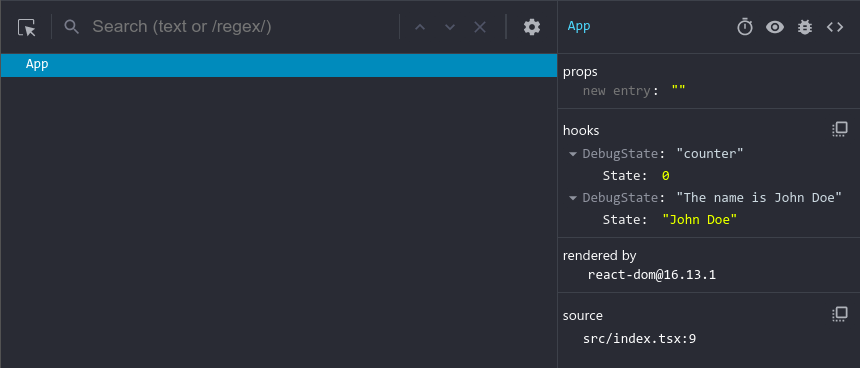

# use-named-state

React hook to use named state for easier debugging with almost no code change  
    [](https://github.com/bhumijgupta/use-named-state/actions/workflows/test.yaml)

## Install

```bash
# Using npm
npm i -S use-named-state
# Using yarn
yarn add use-named-state
```

## Motivation

Most of the time I edit state values directly in react devtools to achieve different state during development. But if there are too many states in a functional component, it gets tricky to know which state is what since they are represented without names in devtools. This is a way to solve that problem by naming the states.

| Before                         | After                        |
| ------------------------------ | ---------------------------- |
|  |  |

## Available hooks

1. `useDebugState()` - Recommended  
    It uses [useDebugValue](https://reactjs.org/docs/hooks-reference.html#usedebugvalue) internally to set debug name for the custom hook.

   ### API

   #### **i. StateName is a string**

   ```typescript
    useDebugState<T>(stateName: string, stateValue:T)
   ```

   #### **ii. StateName is a formatter function**

   This can be useful if state name needs to be computed or is derived from current state value

   ```typescript
    useDebugState<T>(stateName: DebugStateFormatter, stateValue:T, extraArgs?: any);
    type DebugStateFormatter<T> = (val: { state: T; extraArgs?: any }) => string;
   ```

   **Usage**

   ```tsx
   import { useDebugState, DebugStateFormatter } from "use-named-state";
   const stateFormatter: DebugStateFormatter<string> = ({
     state,
     extraArgs,
   }) => {
     return `${extraArgs.prefix} ${state}`;
   };
   const extraArgs = { prefix: "The name is" };
   const App = () => {
     // State name is string
     const [counter, setCounter] = useDebugState("counter", 0);
     // State name is a formatter function
     const [name, setName] = useDebugState<string>(
       stateFormatter,
       "John Doe",
       extraArgs
     );
     return (
       <>
         <button onClick={() => setCounter((prevCount) => prevCount + 1)}>
           {counter}
         </button>
         <input onChange={(e) => setName(e.target.value)} value={name} />
       </>
     );
   };
   ```

**Result**  
 

2. `useNamedState()`  
   It creates an object with key as state name and value as state.

   ```typescript
   import { useNamedState } from "use-named-state";
   const App = () => {
     const [counter, setCounter] = useNamedState("counter", 0);

     return <button onClick={(prevCount) => prevCount + 1}>{counter}</button>;
   };
   ```

   **Result**  
   

## Difference

If you use `useDebugState`, the state name is not leaked to the production build.  
If you use `useNamedState`, the state names are leaked to the production build as well, as the state name is the part of state and not just a label. **This might not be an intended side-effect**

## Build with ♡ by

### Bhumij Gupta


 [](https://www.linkedin.com/in/bhumijgupta/) 

---

```javascript
if (repo.isAwesome || repo.isHelpful) {
  StarRepo();
}
```
